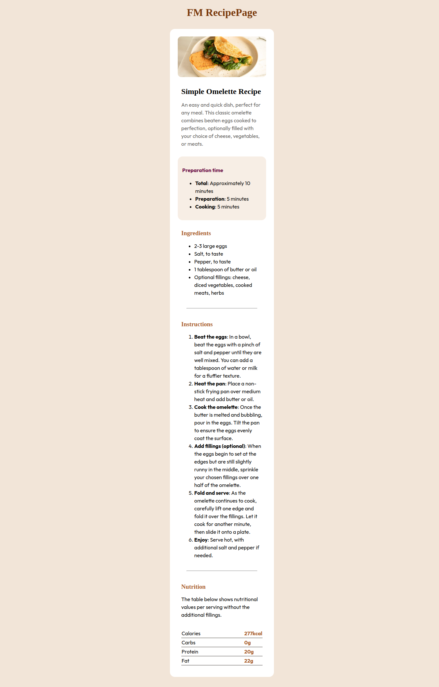
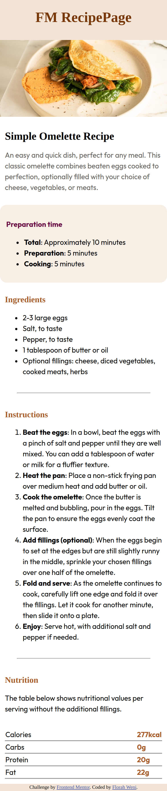

# Frontend Mentor - Recipe page solution

This is a solution to the [Recipe page challenge on Frontend Mentor](https://www.frontendmentor.io/challenges/recipe-page-KiTsR8QQKm). Frontend Mentor challenges help you improve your coding skills by building realistic projects. 

## Table of contents

- [Overview](#1)
  - [The challenge](#1.1)
  - [Screenshot](#1.2)
  - [Links](#1.3)
- [My process](#2)
  - [Built with](#2.1)
  - [What I learned](#2.2)
  - [Continued development](#2.3)
  - [Useful resources](#2.4)
- [Author](#3)

## Overview

Recipe Page, newbie Frontend Mentor challenge. This is the second challenge that I have taken up. I have decided to continue developing the solution with HTML and CSS. 

### Screenshots

#### Desktop Screenshot


#### Mobile Screenshot


### Links

- Solution URL: [Github](https://github.com/mihavier/recipe-page)
- Live Site URL: [Gitpages](https://mihavier.github.io/recipe-page/)

## My process

### Built with

- Semantic HTML5 markup
- CSS custom properties
- Flexbox
- CSS Grid
- Mobile-first workflow

### What I learned

Feedback from the previous review really help, I found myself basically applying a few of the pointers I received to complete this project. I learned a few more html tags as well.

To see how you can add code snippets, see below:

```html
<li>
  <b>Total</b>: Approximately 10 minutes
</li>
